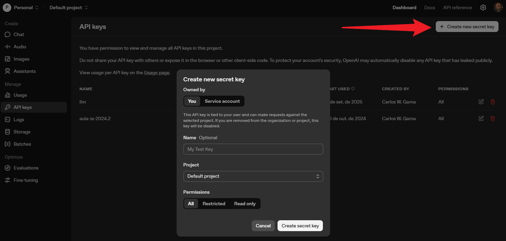

# SCRIPT LLM com  RAG (Retrieval-Augmented Generation) e servidor Express

Script montado para executar comandos na LLM do OpenAI e RAG, porém com facilidade de migração, uma vez que foi utilizado o LangChain no processo. 

## Tecnologias Envolvidas:
LLM:
- Python
- Lagchain 
- OpenAI 


-----
## Configuração


#### Etapa 1 - Criar a Key do OpenAI
Inicialmente, para configurar o projeto é preciso ir o OpenAI, criar uma conta e criar uma chave de acesso ao modelo do OpenAI:

Link: [https://platform.openai.com/api-keys](https://platform.openai.com/api-keys)



#### Etapa 2 - Baixar o Projeto

Instale pelo pacote NPM:
```bash
npm install carloswgama/cwg-llm-openai
```

Ou baixe o projeto do GitHub e instale as dependências:
```bash
git clone https://github.com/CarlosWGama/cwg-llm-openai-python ./projeto
cd projeto
pip install -r requirements.txt
```

#### Etapa 3 - Setar as variáveis de ambiente

Crie um arquivo .env no seu projeto
Nesse arquivo você deve informar:

```bash
CWG_LLM_OPENAI_KEY=<sua api key copiada da etapa 1>
CWG_LLM_OPENAI_MODEL=<A versão do modelo que irá usar como 'gpt-4.1-nano', 'gpt-3-turbo'...>
CWG_LLM_OPENAI_EMBEDDING=<modelo do embedding usado para o rag como 'text-embedding-ada-002', 'text-embedding-3-large' ou 'text-embedding-3-small'	>
```

Exemplo:
```bash
CWG_LLM_OPENAI_KEY=sk-proj-Lr8XNcasdas11vHRl9gBQnpSe2-D0pP2kOBy_q7PsoCTasdasdgyfvOTTPKzH30WWGmOzcf_6PNbJ89D8jd8Ja8j2j92d
CWG_LLM_OPENAI_MODEL=gpt-4.1-nano
CWG_LLM_OPENAI_EMBEDDING=text-embedding-ada-002
```

Fique atendo aos custos dos modelos. Abaixo segue algumas informações dos custoas a cada 1 milhão de tokens:

| Modelo | Preço  |   Tipo |
|--------|--------|--------|
| gpt-5 | $1.25| LLM |
| gpt-5-mini| $0.25 | LLM |
| gpt-5-nano | $0.05 | LLM |
| gpt-4.1 | $2.00 | LLM |
| gpt-4.1-mini	 | $0.40 | LLM |
| gpt-4.1-nano	 | $0.10 | LLM |
| gpt-3-turbo	 | $8.00 | LLM |
| text-embedding-3-small | $0.02 | Embedding (RAG) |
| text-embedding-3-large | $0.13 | Embedding (RAG) |
| text-embedding-ada-002 | $0.10 | Embedding (RAG) |

Lista completa dos preços [preços](https://platform.openai.com/docs/pricing)

#### Etapa 4 - Rodando os Scripts 

##### Exemplo de Rodar o Script Diretamente

primeira importe as funções que deseja executar:

```python
from cwg_llm_openai import ask, ask_from_prompt, save_embedding, ask_from_url, ask_from_pdf, ask_from_embedding
```

###### Exemplo de um comando básico
Exemplo mais básico do uso da IA sem conhecimento extra passado. Todo conhecimento é o do modelo.

```python
from ask import ask

resposta = ask('Quem é Carlos W. Gama?')
print(resposta)
```

###### Exemplo passando um contexto (RAG básico)
Esse tipo de cenário é ideal quando você quer adicionar informações ao conhecimento da LLM, que vem de uma base própria sua. 
```python
from ask import ask_from_prompt

context = 'Carlos W. Gama é um programador'
resposta = ask_from_prompt('Quem é Carlos W. Gama?', context)
print(resposta)
```

###### Exemplo passando uma fonte de URL (RAG da Web)
Esse cenário faz com que a informação buscada de uma página web e convertido para uma base de dados vetorial, de forma com a LLM consiga consultar as informações. 

Nessa etapa é usado o Embedding do OpenAI, que serve para criar o Retriever.
O Embbeding é a representação numérica de seus dados (textos, documentos, etc.) em um formato que o computador consegue entender e comparar.
O embedding padrão usado é o text-embedding-ada-002, que possui um custo de $0.10 a cada 1 Milhão de tokens. 

```python
from cwg_llm_openai import ask_from_url

url = 'https://carloswgama.com.br';
resposta = ask_from_url('Quem é Carlos W. Gama?', url);
print(resposta)
```

###### Exemplo passando uma fonte de PDF (RAG de documento)
Esse cenário faz com que a informação buscada de um arquivo em PDF. É o cenário ideal de quando você já tem um arquivo pdf com o todo o conhecimento da empresa ou regras de negócios que necessita que a LLM conheça. 

Também utiliza o Embedding do OpenAI para criar o retriever da base de dados vetorial.

```python
from cwg_llm_openai import ask_from_pdf

#Informação tirada de alguma fonte
caminho_pdf = './src/example/doc.pdf'
resposta = ask_from_pdf('Quem é Carlos W. Gama?', caminho_pdf)
print(resposta)
```

###### Exemplo passando uma consulta direto de uma base vetorial
Caso deseje, pode salvar um dado passado em RAG para depois consultá-lo diretamente sem precisa converter novamente o arquivo para uma base númerica. O dado fica salvo no seu computador. 
```python
from cwg_llm_openai import ask_from_embedding, ask_from_url

url = 'https://carloswgama.com.br'
arquivoRAG = 'nome_indice'
resposta = ask_from_url('Quem é Carlos W. Gama?', url, arquivoRAG)
print(resposta)

#EM outro momento
arquivoRAG = 'nome_indice'
resposta = ask_from_embedding('Quem é Carlos W. Gama?', arquivoRAG)
print(resposta)
```

Ou caso deseja, pode salvar o arquivo antes para consultá-lo depois

```python
from cwg_llm_openai import ask_from_embedding, save_embedding

arquivoRAG = 'nome_indice'
    
#Exemplo do URL
url = 'https://carloswgama.com.br'
save_embedding(url, arquivoRAG)

#Consultando
arquivoRAG = 'nome_indice'
resposta = ask_from_embedding('Quem é Carlos W. Gama?', arquivoRAG)
print(resposta)

-----
Autor: Carlos W. Gama
Licença: MIT